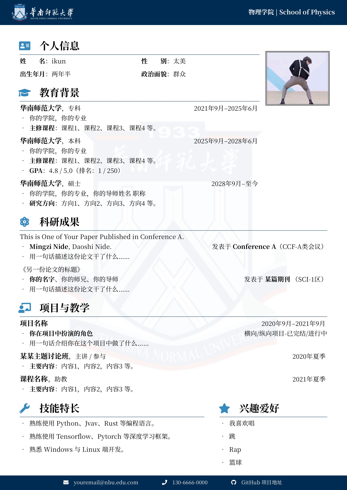

# SCNU ：华南师范大学 LaTeX 中文简历模板

## 简介

基于 [NBU 中文 CV 模板](https://www.overleaf.com/latex/templates/nbu-zhu-bo-da-xue-latex-zhong-wen-jian-li-mo-ban/rwxqrsptnxtq), [SEU 中文 CV 模板](https://www.overleaf.com/latex/templates/seu-cv-dong-nan-da-xue-latex-zhong-wen-jian-li-mo-ban/jyzpthvnbmpm)以及 [NPU 中文 CV 模板](https://www.overleaf.com/latex/templates/npu-cv/mncqzxhvfzrx)的 SCNU 中文 CV 模板。

在原有内容的基础上进行了修改：

- 更改了学校主题色

## 使用方法

- 编辑 `main.tex` 中的内容，对文档样式和内容进行修改。
- 使用 `XeLaTeX` 或 `LuaLaTeX` 编译。
